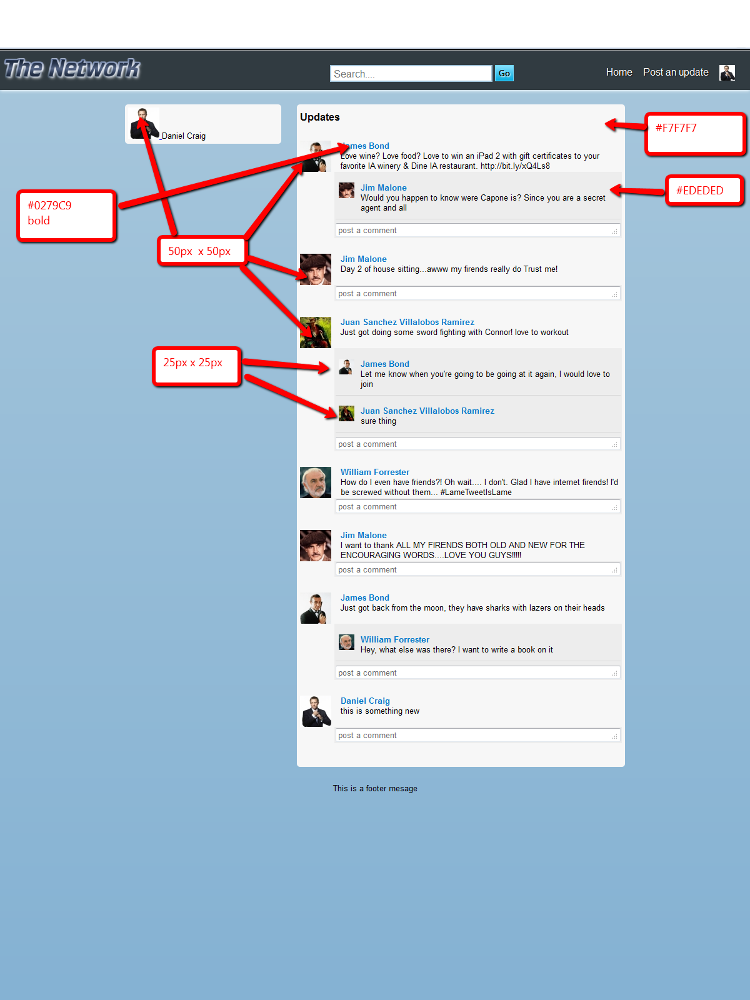

Ontraport Front End Evaluation, Long Test
============================

Congratulations! You passed the first test, just one more hoop to jump through. This is the 
Ontraport 'Front End Long Test'. We use it to gain an understanding of your front end programming 
abilities before we meet face to face. 

We are trying to ascertain your skill level in all areas of front end development (HTML, CSS, 
Javascript, and App Development). We are looking for candidates to fill all sorts of positions at all levels. 
Do your best and don't worry if your skills set is better suited for some parts of test than others. 
Try and have fun with it, show us what you can do!

###Some things we are looking for specifically:

1. Ability to bind into/use existing markup/CSS/models.
2. Take a design screenshot with some dimensions and create the CSS, markup, and layout from it.
3. Determine how you layout your code and what frameworks you choose to use / are familiar with.
4. See how you deal with MVC style of programming.

### Description
Your job is to finish coding a post / comment list engine for a web app. Imagine that your user 
has already logged in and is viewing a list of posts from other users and themselves. The engine has 
a two column layout. In the left column the user can see their profile. In the right column the user 
sees a list of user posts. Some of the posts have comments. There is a link in the app header that 
facilitates adding new posts via a textarea in a light box. If you have time, the engine can store data 
in local storage so it can push it later on (depending on internet connection) to some fictitious 
external data source.

###The test git repo contains: 
    /codetest
        /data
            posts.json                       //posts json data
            users.json                       //users json data
        /images
            /profile                         //user profile pics
                2001_finding_forrester_008.png
                daniel-craig.jpg
                Sean_Connery_as_Ramirez_in_Highlander.jpg
                sean_connery_the_untouchables.jpg
                Sean-Connery-as-James-Bond.jpg
            logo.png                         //app logo
        /resources
            box.js                           //local storage API you can use for the extra credit
        design.png                           //another copy of the design spec in case you lost it
        index.html                           //markup outline for the test, you don't have to use it
        normalize.css                        //CSS reset styles, feel free to remove or replace
        styles.css                           //test specific styles
    code_test_instructions.txt               //text instructions for test    
    code_test_walk_through.avi               //video example of finished test including extra credit  
    code_test_walk_through.swf               //video example of finished test including extra credit
    design.png                               //design spec for the test

### Assumptions:
1. You are logged in as user id 5.
2. The model data for the posts and user is in the /data folder (posts.json, users.json).
3. There needs to be an "interface" for posts, comments, and users.

### Requirements

Fork this repo into your own github account and complete the following:

1. Write the HTML and CSS needed to finish the engine. See styles.css and index.html (you don't 
have to use these files but we think its a good starting point). Try to make the finished product look as close to the design spec as possible (design.png).
2. Load / render the user and post data from the json files in the data folder. Again, loaded 
data should look as close to design.png as possible.
3. Search button needs to have some sort of interaction on hover. Change the colors borders etc..
4. Add a white shadow to the search box when it gains focus.
5. Show a light box / modal window in the middle of the screen when the user clicks on the 'Post An Update' button in the header section.
6. The light box should contain a textarea where the user can type a new post.
7. The user can submit a new post by hitting the enter key, the post should then be added to the end of the posts list.
8. The light box should be removed from view when the user hits the enter key in the textarea.

###Extra Credit Requirements:
1. User can add comments to any post. 
2. Save the user and post data to local storage so if you refresh the page the new posts and comments are reloaded  (Imagine the temporarily doesn't have a network connection. In theory the data in local storage should be able to be sent to the server once there is a stable connection).

###Test Parameters:
1. This test doesn't have a time limit, but we are interested in how long it takes you to complete
as much as you did. A general it took me _ hours will do.
2. Extra Credit Requirements are not required for submission.
3. You are free to use any framework(s) of your choice as long as all requirements are met. 
4. Feel free to structure your code in any way you want. We want to see how you do things.
5. If you want to attempt the extra credit: Check in /resources for box.js its a localstorage framework. It works for anything that supports window.localstorage its kinda buggy for anything else but will get the job done. You don't have to use it but it there if you want to.
       
       
###Example:
Here is video example of a working test

https://raw.github.com/Ontraport/frontend-interview-test-long/master/codetest/images/exampleVideoPreview.png

Good Luck!